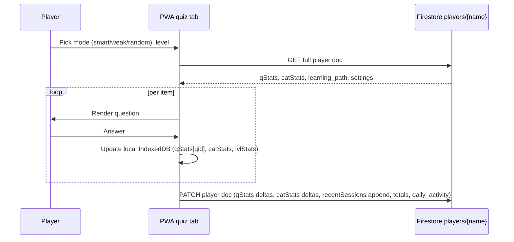
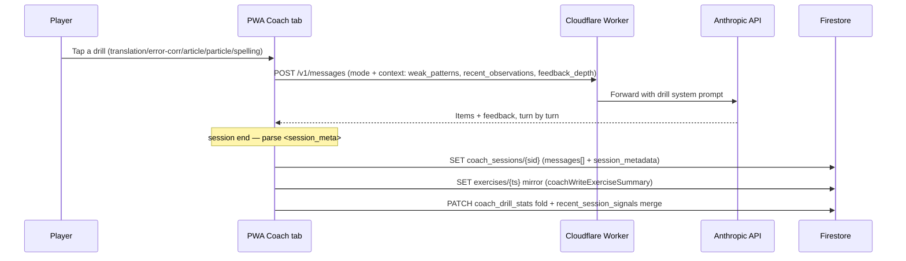
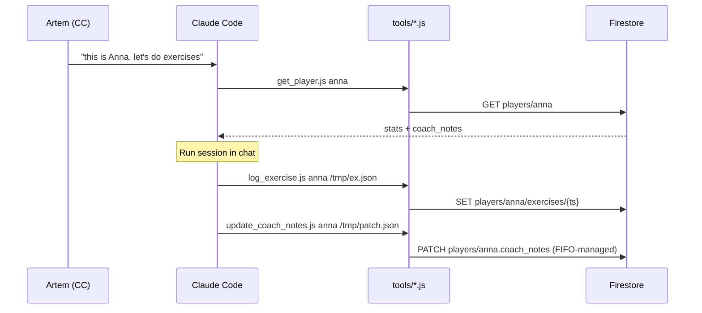
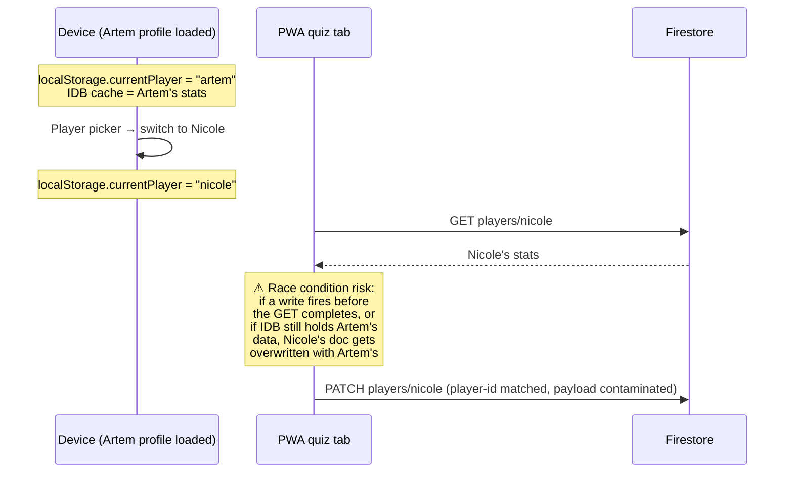
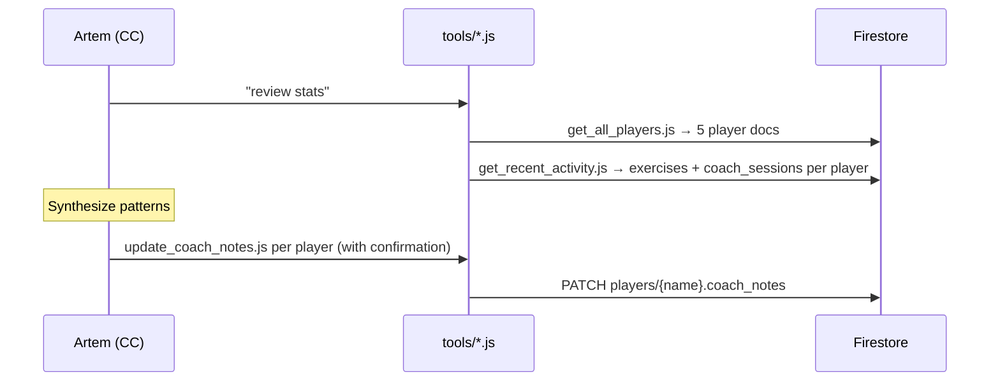

# Data Flow

How user actions on each surface produce reads/writes against Firestore. Use this when planning UI changes, debugging cross-surface bugs, or onboarding to a new flow.

Field-level ownership lives in `references/firestore-schema.md` (writer/reader columns). This doc adds the *flows* that connect those writes.

## Surfaces

| Surface | Code | Reads | Writes |
|---|---|---|---|
| **PWA quiz tab** | `index.html` (play loop) | `players/{name}`; read-only cross-player: family boards (all players), Artem's Nicole-RU program admin (`players/nicole_ru` + exercises) | `players/{name}` (qStats, catStats, lvlStats, recentSessions, totals, streaks, daily_activity) |
| **PWA Coach tab (live AI)** | `index.html` (Coach UI) → Cloudflare Worker | `players/{name}` (context incl. `coach_notes.weak_patterns`); `exercises_library/*` offline fallback only | `players/{name}/coach_sessions/{sid}` + `exercises/{ts}` mirror + `coach_drill_stats` fold + `recent_session_signals` merge |
| **Cloudflare Worker** | `worker/index.js` (`/v1/messages`, `/v1/audio`) | request context only (stateless) | nothing — PWA writes on its behalf |
| **CC `exercise-session` skill** | `tools/log_exercise.js` + `tools/update_coach_notes.js` | `players/{name}` (via `get_player.js`) | `players/{name}/exercises/{ts}`, `players/{name}.coach_notes` |
| **CC `free-write` skill** | `tools/log_coach_session.js` + `tools/update_coach_notes.js` | `players/{name}` | `players/{name}/coach_sessions/{sid}`, `players/{name}.coach_notes` |
| **CC `weak-spots-session` / `interview-prep` skills** | Firebase MCP (remote-CC safe) | `players/{name}`, `worker/index.js` catalogs | `coach_sessions/{sid}`; masked updates to `coach_notes` + fold fields **only** (see bug-log 2026-05-20) |
| **CC `stats-review` skill** | `tools/get_all_players.js`, `tools/update_coach_notes.js` | all of `players/*` + subcollections | `players/{name}.coach_notes`, generated tracker markdown |
| **Library authoring** | `library_drafts/*.json` → `tools/push_library.js` | local drafts | `exercises_library/{type}/items/*` + `_meta` |
| **Math Sprint game** | `mathsprint.html` (standalone, math track) | `math_sprint_scores/*` (all family runs) | `math_sprint_scores/{player}__{mode}__{n}__{ts}` — one immutable doc per run; client prunes each combo to top-50 |
| **Memory trainer** | `memory.html` (standalone, cognitive track) | `memory_trainer_scores/*` (all family runs) | `memory_trainer_scores/{player}__{mode}__{ts}` — one immutable doc per run (level score); client prunes each mode to top-50 |
| **RTDB legacy** | `artem-grammar-hub-default-rtdb.europe-west1.firebasedatabase.app` | read-only | frozen; console deletion pending (overdue since 2026-05-28) |

Two writers touch the player root document: the PWA play loop (everything except `coach_notes`) and `tools/update_coach_notes.js` (only `coach_notes`). One writer touches `exercises` and `coach_sessions` per surface (Coach tab from PWA, `tools/*.js` from CC). No surface owns more than one collection's write path. `math_sprint_scores` and `memory_trainer_scores` sit outside `players/{name}` (game scores only, no learning data) — the within-family-public boards, scoped §6 exceptions (`references/design-decisions.md`).

## Canonical flows

### Flow 1 — Family member plays the quiz tab

**Critical**: the PWA writes the **full player doc shape it has in memory**, scoped by `updateMask`. If the in-memory copy was last loaded for a different player and the player switcher didn't fully reload, the wrong player's stats can be patched into the active player's doc. (Failure mode behind the 2026-05-02 Nicole contamination — see `plans/archive/data-integrity-postmortem.md`.) The sibling failure mode is a **root-doc replace** from a session end-write (2026-05-20 Artem incident — `references/bug-log.md`): any write to `players/{name}` must be a field-masked update naming only its own fields.

### Flow 2 — Family member runs a Coach-tab drill (live AI, since 2026-05-11)

Library content (`exercises_library/*`) survives as offline-only fallback (`liveAvail === false` → `forceLibrary`). `qStats` is **not** updated by the Coach tab directly; the coach→quiz backfill (`tools/backfill_coach_to_quiz_stats.js`) folds drill items with `exercise_id` in batch.

### Flow 3 — CC runs an exercise session for a player

CC never writes to `qStats`. Only the PWA play loop does.

### Flow 4 — Player switches profile on a shared device (contamination-relevant)

This is the unconfirmed root-cause hypothesis for the 2026-05-02 incident. Audit point: any code path that PATCHes `players/{currentPlayer}` should re-read `currentPlayer` *and* the matching IDB cache atomically before writing.

### Flow 5 — Stats review

Stats review reads everything; only `coach_notes` is written, only via `update_coach_notes.js`. The discipline is invariant — see `references/operational-rules.md`.

## Pre-redesign checklist

Before changing any UI surface or write path:

1. Which fields does this surface write? (Check `firestore-schema.md` writer column.)
2. Who else reads those fields? (Reader column.)
3. Is the player ID resolved at write time, or earlier? (Flow 4 risk.)
4. Does this introduce a new write path to a field that has a single canonical writer? (E.g. anything writing `coach_notes` outside `update_coach_notes.js` is a violation.)
5. Are the surface inventory and any affected diagram in this doc still accurate after the change? Update them in the same PR.

## When to update this doc

- New surface added (new tool, new tab)
- New collection or root-level field added
- A flow diagram becomes inaccurate (e.g. write path moved, ordering changed)
- A surface is removed (mark in surface table; remove diagram)

Aim for terse: rough word count <1000. If it grows, narrative detail belongs in `design-decisions.md`, not here.
